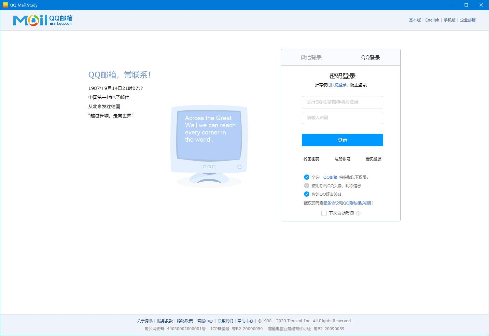
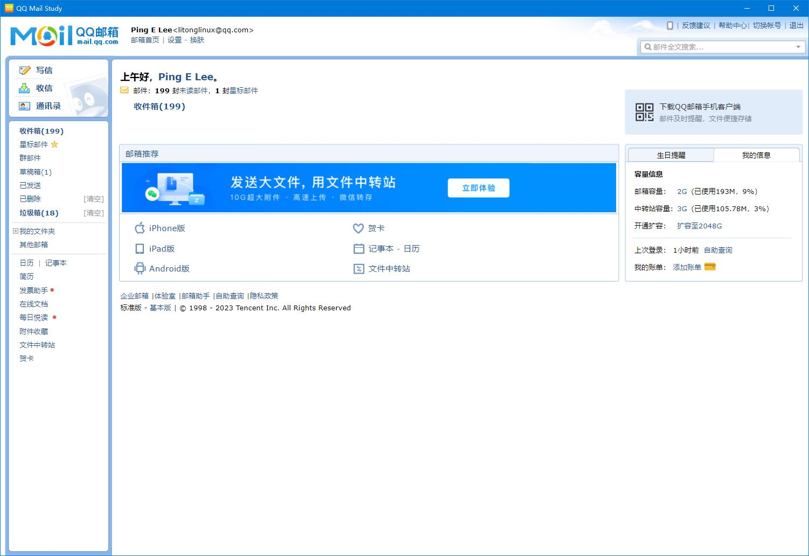

# tauri-qq-mail-study
使用rust语言的tarui框架将QQ Mail 网页版 封装为的QQ Mail 客户端GUI ,这个是学习版本  
The tarui framework of rust language is used to encapsulate the QQ Mail web version as the QQ Mail client GUI,this is study version

